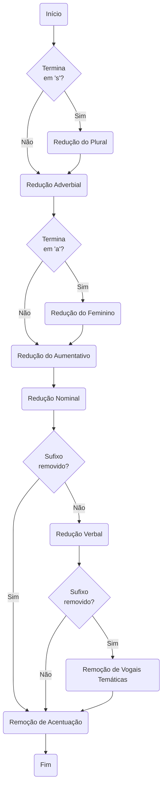

## Algorítmo para remoção de sufixos 

Baseado [neste artigo](https://lume.ufrgs.br/bitstream/handle/10183/23576/000597277.pdf) de Alexandre R. Coelho.

## Uso

### `Palavra(term string) string`
Para converter uma palavra: 
`Palavra("normais") => "norm"`

### `Frase(doc string) string`
Para conveter uma frase:
`Frase("Ajuste a Valor Justo - Investimentos") => "ajust val just invest"`
